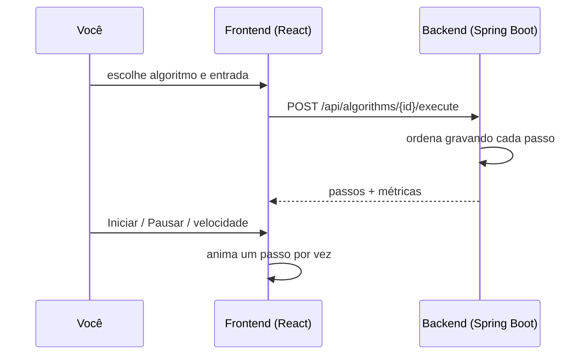

# Pesquisa & Ordenação: Laboratório Interativo de Algoritmos

**Acesse o site: [search-and-sort-website.pages.dev](https://search-and-sort-website.pages.dev/)**

Aprenda algoritmos de ordenação vendo cada um deles funcionar. Escolha uma entrada, aperte **Iniciar** e acompanhe cada comparação, troca e deslocamento, com uma explicação em português para cada passo.

Projeto de estudo desenvolvido por **Mateus Petris**, com Java + Spring Boot no backend e React + TypeScript no frontend.

## O que dá para fazer no site

| Página | O que oferece |
| --- | --- |
| **Algoritmos** | Uma página para cada algoritmo: ideia, passo a passo, exemplo visual, laboratório, implementação em Java, complexidade, melhor e pior caso e comparação com os outros. |
| **Laboratório** | Anima a execução real do algoritmo sobre uma entrada aleatória, ordenada, invertida ou quase ordenada, com até 64 elementos. Mostra as barras, o passo atual e os contadores em tempo real. |
| **Comparar** | Executa de 2 a 4 algoritmos lado a lado sobre exatamente a mesma entrada e gera um gráfico e uma conclusão sobre qual fez menos comparações e movimentações. |
| **Tabela de tempos** | Reproduz o quadro comparativo de tempos de Niklaus Wirth: todos os algoritmos com entradas ordenada, aleatória e invertida para os tamanhos de N escolhidos (até 4096). |
| **Fundamentos** | Conceitos que aparecem em todo o site: o que é ordenação e pesquisa, complexidade de tempo e de espaço, melhor, médio e pior caso, estabilidade e ordenação in-place. |

## Os algoritmos

| Algoritmo | Melhor caso | Caso médio | Pior caso | Espaço extra | Estável | In-place |
| --- | --- | --- | --- | --- | :---: | :---: |
| [Bubble Sort](https://search-and-sort-website.pages.dev/algoritmos/bubble-sort) | O(n²) | O(n²) | O(n²) | O(1) | ✅ | ✅ |
| [Selection Sort](https://search-and-sort-website.pages.dev/algoritmos/selection-sort) | O(n²) | O(n²) | O(n²) | O(1) | ❌ | ✅ |
| [Insertion Sort](https://search-and-sort-website.pages.dev/algoritmos/insertion-sort) | O(n) | O(n²) | O(n²) | O(1) | ✅ | ✅ |
| [Merge Sort](https://search-and-sort-website.pages.dev/algoritmos/merge-sort) | O(n log n) | O(n log n) | O(n log n) | O(n) | ✅ | ❌ |
| [Quick Sort](https://search-and-sort-website.pages.dev/algoritmos/quick-sort) | O(n log n) | O(n log n) | O(n²) | O(log n) | ❌ | ✅ |
| [Shell Sort](https://search-and-sort-website.pages.dev/algoritmos/shell-sort) | O(n log n) | sem fórmula fechada | O(n²) | O(1) | ❌ | ✅ |
| [Heap Sort](https://search-and-sort-website.pages.dev/algoritmos/heap-sort) | O(n log n) | O(n log n) | O(n log n) | O(1) | ❌ | ✅ |
| [Cocktail Shaker Sort](https://search-and-sort-website.pages.dev/algoritmos/cocktail-shaker-sort) | O(n²) | O(n²) | O(n²) | O(1) | ✅ | ✅ |

Em uma frase cada:

- **Bubble Sort:** compara vizinhos e troca quando estão fora de ordem, até que os maiores "borbulhem" para o fim.
- **Selection Sort:** procura o menor elemento do que falta ordenar e o coloca na próxima posição.
- **Insertion Sort:** pega um elemento de cada vez e o insere na posição correta entre os já ordenados.
- **Merge Sort:** divide o array ao meio até sobrarem pedaços triviais e depois os mescla em ordem.
- **Quick Sort:** escolhe o elemento do meio como pivô, joga os menores para a esquerda e os maiores para a direita, e repete em cada lado.
- **Shell Sort:** um Insertion Sort que começa com saltos grandes e vai reduzindo a distância até 1.
- **Heap Sort:** organiza o array como um Max Heap e retira o maior elemento repetidamente.
- **Cocktail Shaker Sort:** um Bubble Sort de ida e volta, que leva o maior para o fim e o menor para o início.

Algumas escolhas de implementação, para os números do site baterem com a teoria:

- **Bubble e Cocktail Shaker** estão na forma básica, **sem parada antecipada**: fazem sempre n(n − 1)/2 comparações. As páginas mostram também a versão com parada e explicam a diferença.
- **Quick Sort** segue a versão de Wirth, com o pivô no meio do intervalo. Por isso entradas ordenadas ou invertidas não caem no pior caso.
- **Shell Sort** usa a sequência original de gaps (n/2, n/4, …, 1). As complexidades da tabela valem para essa sequência.

## Como funciona

O backend executa o algoritmo de verdade e grava cada operação. O frontend só reproduz essa gravação como animação.



1. **Execução gravada.** Cada algoritmo usa um `StepRecorder`: em vez de mexer no array diretamente, ele pede ao gravador para comparar, trocar ou escrever. O gravador faz a operação, conta e tira uma "foto" do array.
2. **Cada passo** traz o tipo de operação (`COMPARISON`, `SWAP`, `PIVOT_SELECTED`, `PARTITION`, `MERGE`, `INSERTION`, `COMPLETE`), o estado do array, as posições envolvidas, o pivô (quando há) e uma mensagem explicando a decisão.
3. **Métricas no estilo de Wirth.** **C** conta comparações entre elementos e **M** conta movimentações, ou seja, atribuições de elementos: uma troca custa 3 e um deslocamento custa 1. Por isso algoritmos com o mesmo número de comparações podem ter custos bem diferentes.
4. **Tabela de tempos sem interferência.** Cada algoritmo também tem uma versão que só conta, sem gravar passos. É ela que a tabela de tempos usa: aquece a JVM, executa várias vezes e mostra a mediana. Um teste garante que as duas versões contam exatamente igual.

### Estrutura do projeto

```text
search-and-sort-website/
├── backend/     Java 21 + Spring Boot 4: API REST
└── frontend/    React + TypeScript + Vite: site
```

<details>
<summary><strong>Backend por dentro</strong></summary>

```text
backend/src/main/java/meuprojeto/pesquisaOrdenacao/
├── algorithm/   os 8 algoritmos, a interface SortAlgorithm e o StepRecorder (Java puro, sem Spring)
├── config/      registro dos algoritmos, CORS e limite de tamanho das requisições
├── controller/  endpoints REST
├── service/     catálogo, execução com passos e tabela de tempos
├── dto/         formato do JSON de entrada e saída
└── exception/   erros de domínio e tratamento global com resposta padronizada
```

| Rota | Para quê |
| --- | --- |
| `GET /api/algorithms` | Lista os algoritmos com complexidade, estabilidade e se é in-place. |
| `GET /api/algorithms/{id}` | Dados de um algoritmo. |
| `POST /api/algorithms/{id}/execute` | Ordena `{"values": [...]}` (até 64 itens) e devolve todos os passos. |
| `POST /api/benchmarks` | Monta a tabela de tempos. Corpo opcional `{"sizes": [256, 2048]}`. |

</details>

<details>
<summary><strong>Frontend por dentro</strong></summary>

```text
frontend/src/
├── api/                 tipos dos DTOs e cliente HTTP
├── design/              tokens do design system (cores, tipografia, espaçamento) e estilos globais
├── components/          componentes reutilizáveis: Button, Badge, Section, CodeBlock, Tooltip, StatusMessage, layout
├── hooks/               useAsync
├── features/
│   ├── lab/             laboratório: geradores de entrada, player dos passos, barras, controles
│   ├── algorithms/      páginas dos algoritmos, conteúdo didático e ilustrações
│   ├── compare/         comparador lado a lado, gráfico de métricas e conclusão
│   └── benchmark/       tabela de tempos no formato do quadro de Wirth
├── pages/               Início, Fundamentos, 404
└── test/                setup e fixtures dos testes
```

Rotas: `/`, `/fundamentos`, `/algoritmos`, `/algoritmos/:id`, `/comparar?algoritmos=a,b`, `/tempos`.

</details>

## Rodando na sua máquina

**Requisitos:** JDK 21, Node.js 22 e npm.

Em dois terminais:

```bash
# 1. Backend (http://localhost:8080)
cd backend
./mvnw spring-boot:run        # Windows: mvnw.cmd spring-boot:run

# 2. Frontend (http://localhost:5173)
cd frontend
npm install
npm run dev
```

Em desenvolvimento, o Vite repassa as chamadas `/api` para `http://localhost:8080`. Para usar outro endereço, defina a variável `BACKEND_URL`.

### Testes

```bash
cd backend && ./mvnw test
cd frontend && npm test
```

O backend tem um teste de contrato que roda os 8 algoritmos sobre 16 tipos de entrada (vazio, duplicados, negativos, extremos de `int`, aleatório grande…) e confere, entre outras regras, que o resultado é igual ao do `Arrays.sort`.

<details>
<summary><strong>Deploy (Railway + Cloudflare Pages)</strong></summary>

O backend fica no **Railway** e o frontend no **Cloudflare Pages**. Como cada um precisa do endereço do outro, a ordem é: backend, frontend e, por fim, o CORS do backend.

### 1. Backend no Railway

1. *New Project → Deploy from GitHub repo* e escolha este repositório.
2. Em *Settings*, defina **Root Directory** como `backend`. O Railway encontra o `backend/Dockerfile` e o usa no build (Java 21).
3. Em *Settings → Networking*, clique em **Generate Domain** e anote o endereço.

A porta não precisa ser configurada: o Railway informa a variável `PORT` e o `application.properties` já a usa.

### 2. Frontend no Cloudflare Pages

1. *Workers & Pages → Create → Pages → Connect to Git* e escolha este repositório.
2. Configuração de build:

   | Campo | Valor |
   | --- | --- |
   | Framework preset | Vite |
   | Build command | `npm run build` |
   | Build output directory | `dist` |
   | Root directory | `frontend` |

3. Em *Environment variables*, crie `VITE_API_BASE_URL` com o endereço **completo** do Railway, incluindo `https://`, **em Production e em Preview**. Ela é lida durante o build: se mudar, faça um novo deploy.

A versão do Node vem de `frontend/.node-version`. Não é preciso configurar redirecionamento para as rotas do React: sem um `404.html`, o Pages entrega o `index.html` em qualquer caminho.

### 3. CORS no Railway

Em *Variables* do serviço no Railway, crie:

```text
APP_CORS_ALLOWED_ORIGINS=https://<projeto>.pages.dev,https://*.<projeto>.pages.dev
```

A segunda origem libera os deploys de preview do Pages (`https://<hash>.<projeto>.pages.dev`). Se usar um domínio próprio, acrescente-o à lista.

### Variáveis de ambiente

| Onde | Variável | Obrigatória | Padrão |
| --- | --- | --- | --- |
| Railway | `APP_CORS_ALLOWED_ORIGINS` | sim | `http://localhost:5173,http://localhost:3000` |
| Railway | `PORT` | definida pelo Railway | `8080` |
| Railway | `SORTING_MAX_ARRAY_SIZE`, `BENCHMARK_MAX_SIZE`, `BENCHMARK_MIN_RUNS`, `APP_MAX_REQUEST_SIZE_BYTES` | não | valores do `application.properties` |
| Cloudflare Pages | `VITE_API_BASE_URL` | sim | vazio (mesma origem) |

</details>

## Para estudar mais

- [Apostila de ordenação e busca do IME-USP](https://www.ime.usp.br/~slago/slago-ordena-busca.pdf)
- [Playlist em vídeo da professora Cinthia (FAESA-ES)](https://www.youtube.com/watch?v=GNmpB_ThHL0&list=PL4CetycR1mc9QsxjtD9YJyjx1Pv8-xBej)
- *Algoritmos e Estruturas de Dados*, de Niklaus Wirth, base das métricas C e M e do quadro de tempos.

## Contribuindo

Quem quiser contribuir é muito bem-vindo! Pode ser corrigir um erro, melhorar uma explicação, adicionar um algoritmo novo ou sugerir uma ideia.

1. Faça um fork do repositório e crie uma branch (`feat/minha-ideia`, `fix/meu-ajuste`).
2. Faça as alterações e rode os testes do backend e do frontend.
3. Abra um Pull Request contando o que mudou e por quê.

Se preferir, abra uma [issue](https://github.com/mateuspetris/search-and-sort-website/issues) com a sugestão ou o problema encontrado.

## Gostou?

Se o projeto te ajudou a entender ordenação, **deixe uma ⭐ no [repositório](https://github.com/mateuspetris/search-and-sort-website)**! Isso ajuda outras pessoas a encontrarem o laboratório.
